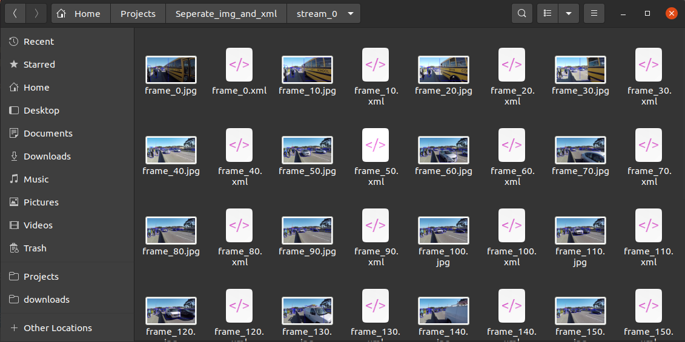
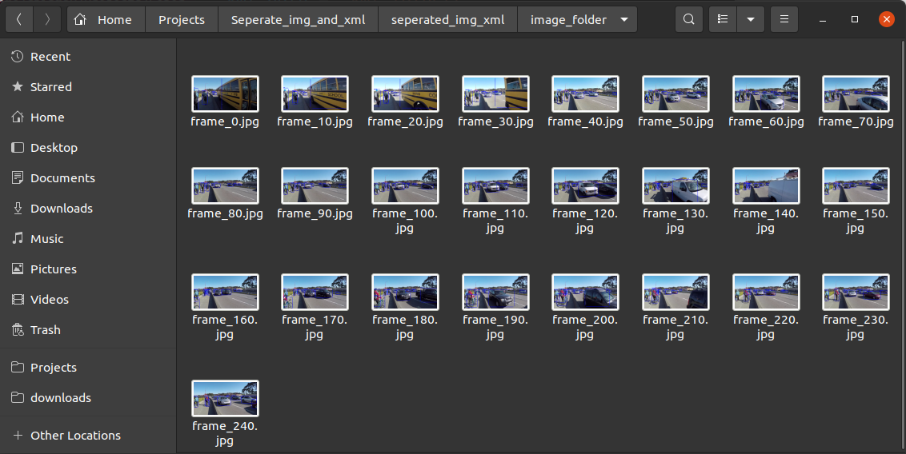
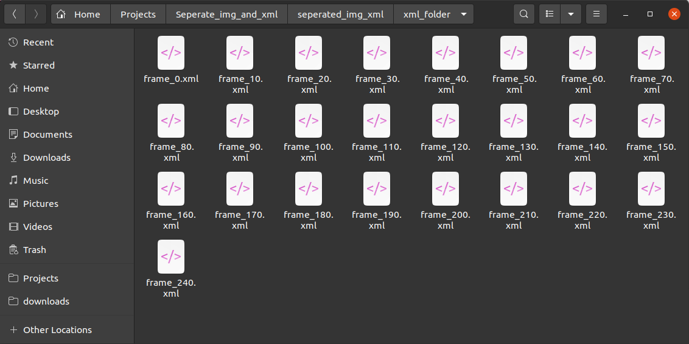

# Seperate-img-and-xml

## Inroduction
This script seperates `images` and its corresponding `xml` files which are placed into same folder into two different folders.

## Use
```sh
git clone https://github.com/chinmay-d/Seperate-img-and-xml.git

cd Seperate-img-and-xml

python sep_img_and_xml.py
```

## Output images
Folder with image and xml
<p float="right">
    
</p>

Seperated image folder
<p float="right">
    
</p>

Seperated xml folder

<p float="right">
    
</p>


## License
This project is totally free to use, although credit would be appreciated in case of any reuse of the work.
